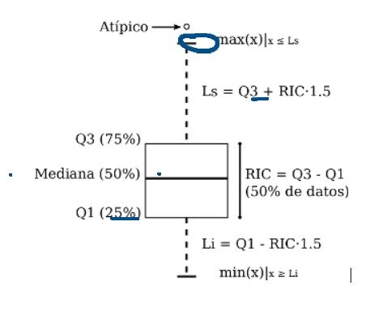

# LAB 05: Limpieza de Datos

## 1. Utilizando el dataset de la ENAHO revise la distribución de las edades para cada género, utilice la función: hist()

```{r}

# load csv

df_data <- read.csv("brecha_salarial_2020_1T.csv")

#Convertimos sexo en variable nominal

df_data[["sexo"]]<-factor(df_data[["sexo"]])

library(tidyverse)

# histograma por genero

df_data_mujer <- df_data |>
  filter(sexo == "mujer")

df_data_hombre <- df_data |>
  filter(sexo == "hombre")


hist(df_data_mujer$edad)
hist(df_data_hombre$edad)

```

## 2. Revise la distribución de las remuneraciones 

```{r}

# histograma de remuneración con ggplot
df_data %>%
  ggplot(aes(x = ingresos_totales)) + 
  geom_histogram(binwidth = 1000) + 
  facet_wrap(vars(sexo))

```

## 3. ¿Qué puede observar sobre la distribución de las remuneraciones?

> De primera impresion se puede observar que hay una mayor concentracion de sueldos entre 0 y 5000 soles, para ambos generos. Asimismo, la renumeracion de hombres presenta una mayor cantidad insidencias con respecto a mujeres.

## 4. Una de las técnicas que se utilizan en economía y estadística es linealizar algunas variables que tienen asimetría positiva utilizando la función logaritmo, utilice la función log a los ingresos y vuelva a realizar el histograma, ¿qué observa?.

> Se puede observar que la grafica es mas amigable y centrada para sacar el analisis previo.

```{r}
# histograma de log(remuneración) con ggplot

df_data[["log_ingresos"]] <- log(df_data[["ingresos_totales"]])

df_data %>%
  ggplot(aes(x = log_ingresos)) + 
  geom_histogram() + 
  facet_wrap(vars(sexo))
```
## 5. Uno de los gráficos más útiles que existen para revisar la distribución de un vector de valores es el diagrama de cajas que tiene la estructura que se presenta a continuación.


Utilicemos las funciones en R para obtener los cuartiles, para ello utilizaremos la función quantile que acepta 2 parámetros: vector de valores y la frecuencia relativa acumulada, así por ejemplo, si queremos el Q1 que es el valor que acumula el 25% de las observaciones se escribe: 
quantile(ingresos, 0.25)

Si deseamos obtener el Q2 que acumula el 50% se escribirá:
quantile(ingresos, 0.50)

### ¿Cómo se le conoce a Q2?

> Q2 (0.50) - Tambien es conocido como la Mediana.

El Rango Intercuartílico, RIC, se define como la diferencia de Q3 – Q1, calcule este valor.

Los bigotes se obtienen multiplicando el RIC * 1.5 y sumando a Q3 o restando a Q1, los valores que se encuentran fuera de valores se denominan atípicos.

Calcule todas las estadísticas requeridas la caja de los ingresos de los hombres.

Tarea: realice los mismos cálculos para los ingresos de las mujeres.

En R existe una función que hace los cálcuos y gráfico de cajas por nosotros, la función se llama boxplot, utilice la función para obtener el gráfico de cajas de la los ingresos de hombres:

boxplot(ingresos_hombres)

La función boxplot también permite segmentar por medio de una variable categórica y acepta la nomenclatura de fórmula y un parámetro adicional de datos que hace referencia a un data frame.

boxplot( ingresos ~ sexo, df_datos)

## ¿Qué puede concluir de ese diagrama?


